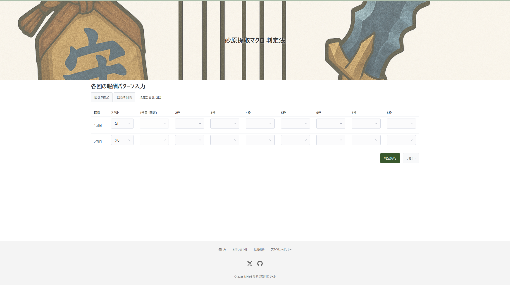

# 砂原採取マクロ 判定法

モンスターハンター3G（MH3G）の砂原採取クエストの報酬パターンから現在の乱数テーブル（T1〜T17）を判定するウェブアプリケーションです。

## 概要

クエストの報酬で得られたアイテムのパターンを複数回分入力することで、現在の乱数テーブルを特定します。デフォルトでは2回分の入力が可能ですが、最大10回まで追加できます。

## 使い方

1. `src/index.html`をウェブブラウザで開きます
2. 各回のクエストについて、以下を入力します：
   - **スキル**: なし/幸運/激運 を選択
   - **報酬枠**: 2〜8枠目に得られたアイテム（釣りミミズ/生肉/砥石）を選択
   - ※1枠目は固定枠のため入力不可
   - ※アイテムが得られなかった（スカだった）枠は空欄のまま
3. 「判定実行」ボタンをクリック
4. 判定結果に候補となるテーブルが表示されます（例: `T1`, `T5`など）

## 機能

- **回数の追加/削除**: 判定精度を上げるため、最大10回まで入力可能
- **データの自動保存**: 入力内容はブラウザのローカルストレージに自動保存
- **リセット機能**: 入力内容を初期状態に戻す

## 判定の仕組み

### 報酬アイテムの確率
- 釣りミミズ: 50%（乱数値 0-49）
- 生肉: 25%（乱数値 50-74）
- 砥石: 25%（乱数値 75-99）

### スキル効果
4枠目以降で「スカ」になる確率が変動：
- なし: 22/32
- 幸運: 26/32
- 激運: 29/32

### 乱数消費
- クエスト1回につき固定で32個の乱数値を消費
- 各報酬枠で2個ずつ乱数を使用（スカ判定用と報酬決定用）

## 技術仕様

- **フレームワーク**: Alpine.js v3.13.5（リアクティブUI）
- **スタイリング**: Pico CSS v2（レスポンシブデザイン）
- **データ**: `data/table-seed.csv`（事前計算済み乱数シード値）
- **ビルド不要**: CDNから依存関係を読み込む静的サイト

## データファイル

`data`ディレクトリ：
- `table-seed.csv`: 各テーブル（T1-T17）の乱数シード値
- `table-judgement.csv`: 報酬確率の閾値定義
- `judge-table.xls`: 元データ（Sheet1=判定表、Sheet2=シード値）
- `macro.md`: 元となるVBAマクロのコード

## 注意事項

- このツールは非公式なものであり、ゲームの制作者様とは一切関係ありません
- 判定結果は100%の正確性を保証するものではありません

## AI支援

`CLAUDE.md`ファイルを必ず参照してください。このファイルは、AIアシスタント（Claude Code）とのやり取りに関するガイドラインを提供します。